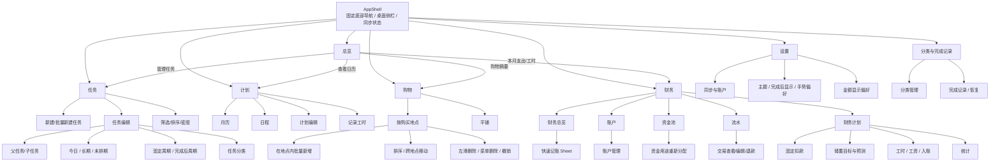
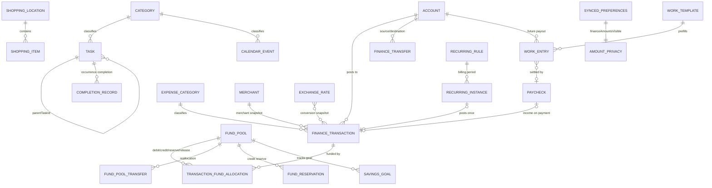
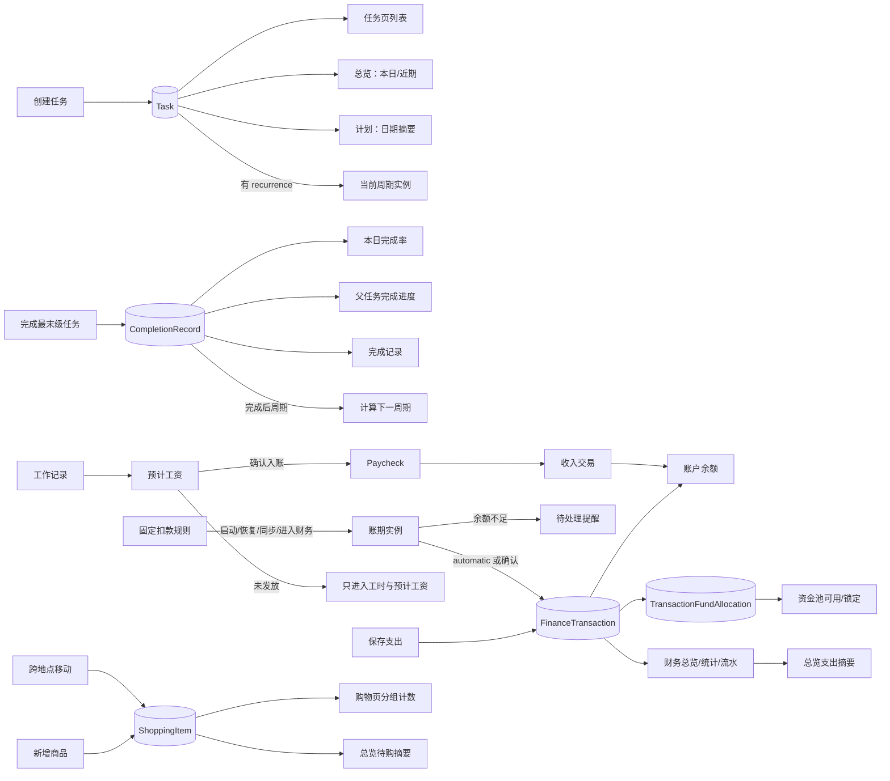
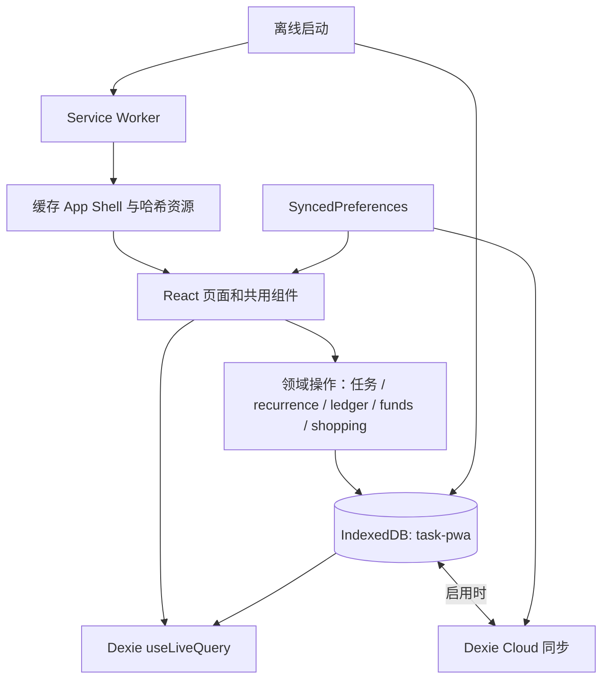

# Task PWA：现状逻辑图与动线优化方案

> 基于当前仓库（React、HashRouter、Dexie/IndexedDB、可选 Dexie Cloud、PWA Service Worker）整理。本文描述已经存在的产品结构，以及不破坏现有数据模型的推荐演进路径。

## 1. 当前产品边界

### 一级导航

| 一级页 | 当前职责 | 主要数据来源 |
| --- | --- | --- |
| 总览 | 汇总本日任务、未来七天、购物摘要、固定任务、本月支出与工时 | Task、CompletionRecord、CalendarEvent、ShoppingItem、WorkEntry、Account、FinanceTransaction、ExchangeRate |
| 任务 | 创建、筛选、排序、完成和编辑每日/每周任务；维护父子任务、排期与周期 | Task、CompletionRecord、Category、SyncedPreferences |
| 计划 | 月历、时间/日程视图、当天计划、工作记录入口 | CalendarEvent、Task、CompletionRecord、Category、WorkEntry |
| 购物 | 按地点或平铺管理商品，完成、删除、排序、跨地点移动 | ShoppingLocation、ShoppingItem |
| 财务 | 总览、账户、资金池、流水、计划（固定扣款、储蓄预测、工时工资与统计） | Account、FinanceTransaction、FundPool、RecurringTransactionRule、SavingsGoal、WorkEntry 等 |

设置与“分类和完成记录”属于二级页面，不占底部一级导航。底部导航及页面背景由 AppShell 持续挂载，一级内容在路由视口中切换。

## 2. App 逻辑图

### 2.1 页面、入口与数据联动

### 2.2 核心数据关系

说明：`AMOUNT_PRIVACY` 不是业务表，只表示 `SyncedPreferences.financeAmountsVisible` 这一全局 UI 偏好。它不进入流水、余额或统计计算。

### 2.3 跨页面状态变化

## 3. 数据与运行架构

- 业务对象使用软删除和确定性/稳定 ID，保证离线与多端同步可合并。
- 迁移在 `db.on('ready')` 和版本迁移层执行；不得清空 IndexedDB。
- Service Worker 缓存应用代码与静态资源，IndexedDB 保存用户业务数据，两者生命周期不同。
- 金额隐私只改变 React 展示层；输入值、交易原始金额、换算快照和同步数据均不变。

## 4. 典型用户动线（当前逻辑与推荐优化）

### 4.1 创建并完成今日任务

**当前最短路径**：任务 → `＋` → 多行输入 → 选择“今日必须完成”/日期 → 添加 → 勾选完成。

**联动**：Task 写入后同时出现在任务页、总览“本日计划”和计划日期摘要；完成生成 CompletionRecord，总览完成率、父任务进度和完成记录立即更新。

**优化**：

1. 首页“本日计划”保留单击完成，右侧 `＋` 直接打开预填为今天的任务 Sheet。
2. 最近使用的分类、任务类型和截止时间建议作为显式默认值展示，保存前可改。
3. 完成反馈遵循“勾选 → 删除线 → 根据全局偏好折叠/隐藏”，不要立即无反馈消失。

### 4.2 创建长期任务与查看 DDL

**当前路径**：任务 → 新建/编辑 → 长期任务 → 开始日期、DDL、提前出现天数 → 保存。

**联动**：开始前保留在长期任务和日历；进入执行期后进入“近期下一步”；临期和逾期状态在任务、总览、计划日期详情同步计算。

**优化**：

- 用三个模板减少日期概念负担：`今天完成`、`在一段时间内完成`、`暂不排期`。
- 长期任务表单默认只显示开始日和 DDL；“开始前隐藏/提前出现”折叠进高级设置。
- 卡片只显示一个最重要的时间标签，例如“3 天后截止”，避免类型、日期、DDL 多标签叠加。

### 4.3 创建父任务并拆分子任务

**当前路径**：创建父任务 → 编辑任务 → 新增子任务/选择父任务 → 子任务默认继承父时间范围。

**联动**：父进度由最末级子任务完成情况推导；本日完成率只统计当天实际执行的最末级任务，避免父子重复计数。

**优化**：

- 在父任务详情中提供“拆成步骤”主操作，而不是要求用户理解 `parentTaskId`。
- 子任务默认继承分类、时间范围；一旦用户单独修改，显示“独立日期”标记。
- 子任务 DDL 超出父任务时提供二选一：延长父任务 / 将子任务移出该父任务，避免隐式覆盖。

### 4.4 使用周期任务

**当前路径**：任务 → 固定任务 → 设置每天/每 X 周/每 X 月或完成后周期 → 保存；工具栏同步按钮补齐当前周期。

**联动**：周期模板仍是一条 Task，CompletionRecord 按 occurrenceKey 记录每期结果；同步使用确定性周期键，避免重复实例。

**优化**：

- UI 先提供“固定日期重复”和“完成后再计时”两种意图，再展开周期参数。
- 同步按钮只负责修复缺失实例，并清楚反馈“已补齐/当前已最新”，不与云同步概念混用。

### 4.5 添加购物项目并按地点管理

**当前路径**：购物 → 按地点 → 指定地点批量新增；长按拖动排序/跨地点，更多菜单提供“移动到…”和删除；横向左滑露出删除。

**联动**：ShoppingItem 的 locationId/rank/purchaseStatus 写入 IndexedDB，同步后总览待购数和地点计数共同更新。

**优化**：

- 购物首页默认打开最近使用地点，输入框记住地点但明确显示。
- 商品行保持 List Row；拖动把手只在编辑/拖动状态出现。
- 左滑、长按、纵向滚动维持手势方向锁；删除提供短时撤销。

### 4.6 记录支出：支付账户与承担资金池

**当前最短路径**：财务 → `＋` → 支出 → 金额 → 支付账户 → 资金来源/承担资金池 → 分类/商家 → 保存。

**数据含义**：

- **支付账户**回答“现实中从哪里付钱/形成谁的负债”。
- **承担资金池**回答“这笔钱在预算归属上由哪一笔用途资金承担”。
- 一笔支出只产生一次现实交易；资金池分配不是第二次扣款。

**优化**：

1. 表单在两个 Picker 前加入短句：`付款方式` / `这笔钱算谁的用途资金`。
2. 根据分类和最近使用值预填，但在保存按钮上方再显示一行确认摘要：`日本银行账户 · 父亲房租专项`。
3. 资金池不足时显示差额和“更换/拆分”，禁止静默转到自由资金。
4. 常规用户先看到单资金池；“拆分资金来源”作为二级操作。

### 4.7 查看余额、专项与可自由支配金额

**当前路径**：财务 → 总览查看净资产/可自由支配；账户看现实余额；资金池看用途分配。

**优化**：

- 总览先回答三个问题：`我现在有多少`、`真正可以花多少`、`哪些不能自由使用`。
- 账户页只解释现实存放位置；资金池页只解释用途归属。两页顶部都显示一行公式/说明。
- 金额隐私眼睛保持全局同步；隐藏时不影响名称、币种、结构和输入。

### 4.8 记录工时并计算工资

**当前路径**：计划日期详情或财务“计划” → 记录工时 → 应用模板/时段/休息/时薪/入账账户 → 保存；实际发放时结算工资。

**联动**：未结算 WorkEntry 只影响预计工资；结算创建 Paycheck 与收入交易，才增加账户余额，并防止同批记录重复入账。

**优化**：

- 日历当天的“记录工时”保留最短入口。
- 默认带入最近模板、地点、休息、时薪和入账账户，但用“已使用：模板名”让默认行为可见。
- 财务总览只展示预计工资和待结算数，详细编辑下沉到工时列表。

### 4.9 查看储蓄与预测

**当前路径**：财务 → 计划 → 储蓄目标/预算假设/月底预测。

**优化**：

- 预测结果旁固定提供“基于什么”入口，展开预计收入、固定扣款、已发生支出、计划支出、剩余生活预算。
- 区分“已储蓄（资金池余额）”与“预计月底可储蓄（模型结果）”，不混用同一种卡片标题。
- 父亲专项始终从个人储蓄和可自由支配中排除。

### 4.10 使用首页快速处理最重要事项

**推荐顺序**：

1. 本日任务完成率与今日必须完成。
2. 逾期/今天截止（仅有时出现）。
3. 未来七天与近期可执行长期任务。
4. 购物待购摘要。
5. 财务轻摘要（本月消费和工时，金额受隐私偏好控制）。

首页只提供完成、进入详情和快速新增，不承载账户编辑、资金池重分配、固定扣款规则等管理操作。

## 5. 当前主要动线问题

| 问题 | 影响 | 具体调整 |
| --- | --- | --- |
| 财务“计划”同时承载固定扣款、储蓄、工资、统计 | 标签语义偏宽，用户难预判 | 保持五个一级财务标签不变，进入“计划”后增加清楚的区块导航；后续可改名“计划与工资” |
| “同步周期任务”和云同步容易混淆 | 用户不知道按钮是否联网 | 周期按钮统一文案“补齐本期任务”；云同步只出现在全局状态/设置 |
| 支付账户与资金池都是选择项但语义接近 | 容易把内部用途分配误解为第二次扣款 | 重新命名字段、增加确认摘要、首次使用提供一屏解释 |
| 复杂设置在主页面占空间 | 首屏数据密度降低 | 默认时薪、汇率来源、账户归档、分类合并放二级页面 |
| 多个入口都可新增，但默认值不透明 | 快但容易记错对象 | 入口可保留，Sheet 顶部明确显示上下文默认值（日期/地点/交易类型） |
| 列表项仍可能卡片化过度 | 浏览效率低 | Section Card 负责分组，内部统一 List Row；详情才使用完整卡片 |
| 首页与任务/计划可能重复展示同一事项 | 用户不理解是副本还是同一数据 | 所有入口直接操作同一 Task/CalendarEvent，并在文案上使用“来自任务/计划” |

## 6. 推荐信息架构

### 一级导航（保持 5 项）

1. **总览**：跨模块摘要和直接完成。
2. **任务**：今日/长期/周期、父子、分类、筛选。
3. **计划**：月历、日程、日期关系和当天工时入口。
4. **购物**：地点分组、商品完成与移动。
5. **财务**：资金结果、记账、账户/资金池/工资与预测。

设置继续由各页右上角或桌面侧栏进入，不占底部导航。

### 财务内部

- **总览**：净资产、可自由支配、消费、预计工资、最近流水。
- **账户**：现实资产/负债/外部账户及余额。
- **资金池**：自由、专项、储蓄、锁定与重新分配。
- **流水**：支出、收入、转账、还款、充值、退款；搜索与筛选。
- **计划**：固定扣款、储蓄目标与预测、工资与工时、统计。

### 任务内部

- 顶部只保留每日/每周范围与视图设置。
- 列表筛选：今日、长期、有 DDL、逾期、已完成。
- 编辑 Sheet：基本信息 → 排期 → 周期 → 父子/高级；默认只展开当前需要的层级。

## 7. 最短创建路径

| 对象 | 推荐入口 | 默认值 | 保存后去向 |
| --- | --- | --- | --- |
| 今日任务 | 总览本日计划 `＋` / 任务页 `＋` | 今天、最近分类 | 总览 + 任务 + 计划摘要 |
| 长期任务 | 任务页 `＋` → 长期 | 今天开始、无 DDL（要求用户确认） | 任务长期筛选 + 计划 |
| 支出 | 财务右上 `＋` | 支出、最近币种/账户/资金池/分类 | 流水 + 账户/资金池 + 总览 |
| 购物商品 | 购物地点内输入 | 当前地点 | 当前地点列表 + 总览待购 |
| 工时 | 计划当天“记录工时” | 当前日期、最近模板 | 日期详情 + 财务预计工资 |

## 8. 组件呈现规则

- **列表**：任务、商品、流水、工时记录、完成记录。
- **卡片**：首页一级摘要、月历、净资产/可自由支配、资金池/账户分组。
- **详情页**：账户历史、任务完整属性、固定扣款规则、储蓄目标。
- **Bottom Sheet**：快速新增、筛选、Picker、轻量编辑和移动到。
- **Modal（桌面）**：与移动 Sheet 同一业务组件的桌面承载形态。

## 9. 迭代优先级

### P0：降低错误与理解成本

1. 支付账户/资金池字段说明、确认摘要和不足校验。
2. 任务创建时明确今天/长期/未排期三种意图。
3. 首页重复事项统一来源和直接操作。
4. 金额隐私覆盖所有结果型金额，并持久化（本次已实现）。

### P1：缩短路径与提高密度

1. 总览和日期详情的上下文快速新增。
2. 财务“计划”内部区块导航。
3. Section Card + List Row 统一替换一条一大卡。
4. 最近使用值、工作模板和分类默认规则。

### P2：解释性与高级能力

1. 预测假设可解释面板。
2. 首次使用资金池的引导和示例。
3. 账户/资金池/交易的审计轨迹和回滚可视化。
4. 更强的跨模块搜索与命令面板。

## 10. 金额隐私行为规范

- 入口：财务持久工具栏中的眼睛按钮；手机触控区 44px，桌面 40px。
- 默认：既有和新用户默认显示，用户主动隐藏后跨页面、刷新与重开保持。
- 范围：财务总览、账户、资金池、流水、工资、统计、储蓄预测与首页财务摘要。
- 排除：快速记账、账户编辑、预算编辑等输入过程。
- 存储：`SyncedPreferences.financeAmountsVisible`；不修改任何业务金额。
- 隐藏文本：保留币种/正负语义，数字统一显示为 `••••`，避免因位数暴露数量级。
- 无障碍：按钮使用 `aria-pressed` 和“显示/隐藏所有金额”的可读标签；隐藏值对读屏说明为“金额已隐藏”。

